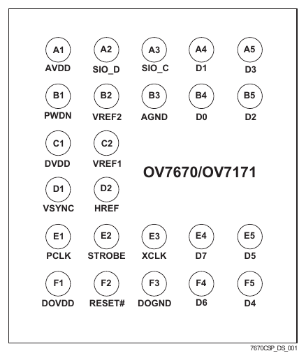
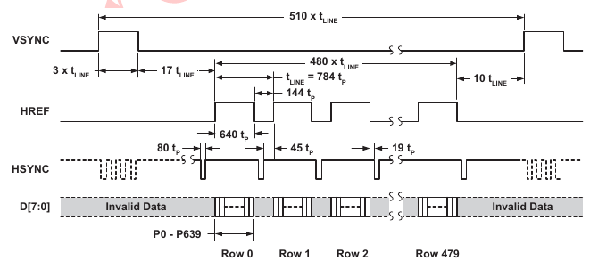

## ELECTRÓNICA DIGITAL 1 2020 -2 UNIVERSIDAD NACIONAL DE COLOMBIA
## TRABAJO 02- diseño y prueba del HDL para la cámara OV7670

## Integrantes 

Esteban Ladino Fajardo

Johan Leonardo Castellanos

Nikolai Alexander Caceres

Andrés Felipe Beltrán 

<span style="color:red">Consideraciones</span>
- Recuerde, esta documentación debe ser tal que, cualquier compañero de futuros semestres comprenda sus anotaciones y la relación con los módulos diseñados.


*Figura 1.Esquema general*


### Tareas asignadas
#### 1. Módulo captura_datos_downsampler.v


*Figura 2.Módulo de captura de datos*

Se van a describir las entradas y salidas del bloque de la Figura 2.

* Href: Está sincronizado con PCLK ( Pixel  Clock Output)[1,pág 4] de tal manera que el t<sub>PHL</sub> (tiempo de propagación de alto a bajo) coincide con el instante justo antes de cambiar de su estado low tal como se muestra en la Figura 3. Además, pasados un definido número de tPCLK ( Pixel Clock Output)[1, pág 4] el cambio de su estado High ocurre en otro  tPHL del PCLK. Row data hace referencia datos de una fila según el formato elegido.


*Figura 3. Sincronización de PCLK, HREF, D[7:0] y distribución de pixeles.*

* Datos [7:0]: En la Figura 3 se muestra que cuando HREF está en HIGH se generan los datos de una fila de la matriz según el tamaño predefinido para la imagen. En el caso del formato RGB 444, cada pixel tiene 2 bytes donde cada uno está compuesto por un vector de D[7:0] y se generan por cada negedge del PCLK. Los cuatro bits menos significativos del primer byte pertenecen al color rojo, en el segundo byte los cuatro bits más significativos son del color verde y los restantes del color azul. Finalmente, se infiere de la Figura 4 que los datos D[i] ingresan de manera paralela y por tanto se deben declarar siete entradas.


*Figura 4. Diagrama de pines en la vista superior [1, pág 1].*

* Vsync: Vsync (Vertical sync output)[1, pág 4] cuando está en LOW permite capturar los datos hasta que todas las filas que conforman las fotos son llenadas y cada vez que pasa de estado LOW a HIGH se comienza a tomar una nueva foto como se observa en la Figura 5. En nuestro caso elegimos un formato 160x120, ya que dentro de las funcionalidades de la cámara, se permite hacer un escalamiento del formato CIF hasta 40x30 [1,pág 1].  


*Figura 5. VGA(640x480) Frame Timing [1, pág 7].*

Con el tamaño de Imagen de QQVGA (160x120, 160 columnas y 120 filas) HREF se comporta como se indica en la Figura 6. Entonces, por cada cuatro periodos de HREF VGA se genera un  periodo de HREF QQVGA, lo que produce una reducción en la cuarta parte del número de filas como se ilustra en la Figura 5, pasando así de 480 a 120 columnas. De la misma manera, si HREF solo está activo uno de cada cuatro periodos se reduce el número de columnas de 640 a 160 como se indica en la Figura 3, dando así el resultado esperado que es el formato 160x120.      


*Figura 6. QQVGA frame timing [1, pág 7].*


Analizando los tiempos que se presentan en la Figura Figura 5 se tiene:
  - tp=2*t<sub>PCLK</sub>(pixel clock output period) [1, pág 7]
  - t<sub>LINE</sub>  => 640 tp + 144 tp= 784 tp= 1 568 t<sub>PCLK</sub>
  - 480xt<sub>LINE</sub> = 62720 +12544= 752 640 t<sub>PCLK</sub>
  - 510xt<sub>LINE</sub> (Periodo de la VSYNC) =>  (3+17+480+10)xt<sub>LINE</sub>= 799 680 t<sub>PCLK</sub>  

* Addr: Dirección donde se va a guardar el pixel de AW (Address Width ) bits.

* datos: El pixel extraído de la cámara de DW (Data Width) bits.

* Write:  Habilita la escritura en el Buffer.


***RECUEDE: Es necesario documentar el módulo diseñado con los respectivos diagramas funcionales y estructurales y registrar la información en README.md***

#### 2. Revisar si el bloque PLL, `clk_32MHZ_to_25M_24M.v`

- Adaptar el bloque azul PLL para las frecuencias de 24 MHz y 25 MHz para la pantalla VGA y la cámara respectivamente según la FPGA a utilizar, que en nuestro caso tiene un reloj de 50 MHz. El archivo es clk_32MHZ_to_25M_24M.v y se encuentran en el interior de la carpeta hdl/scr/PLL.

Para este hito se recomienda generar un nuevo PLL con `Clocking Wizard`. en el IDE de ISE debe utilizar `tools -> Core Generator ...` y general el ip con Clocking Wizard. Una vez, generado el nuevo bloque de Clk:
* Copiar el archivo en la carpeta `hdl/scr/PLL`.
* Remplazar en el proyecto **test_cam.xise**, el archivo `clk_32MHZ_to_25M_24M.v` por el generado pro ustedes.
* Cambiar los datos necesarios en el archivo `test_cam.v` para instanciar el nuevo PLL.
* Documentar en README.md el proceso realizado.

Supongo que seguir los cuatro primeros pasos.


#### 3. Modificación del archivo test_cam.v para señales de entrada y salida de la cámara.

 Modificar el módulo test_cam.v para agregar las señales de entrada y salida necesarias para la cámara (señales amarillas del diagrama).


#### 4. Instanciamiento módulo captura_datos_downsampler.v

Instanciar el módulo diseñado en el hito 1 y 2 en el módulo `test_cam.v`.

- Supongo que es solamente el hito 1.

#### 5. Implementación del proyecto

 Implementar el proyecto completo y documentar los resultados. Recuerde adicionar el nombre de las señales y módulos en la Figura 1 y registre el cambio en el archivo README.md


##### Módulo `clk24_25_nexys4.v` 

Se genero el modulo clk24_25_nexys4.v con ayuda de la ip clock wizard v6 disponible para vivado teniendo en cuenta los paramatros del proyecto, como apoyo se consulto la documentación del fabricante del Clock Wizard v6 [2]


Se asigna el valor del reloj primario de acuerdo a la FPGA que trabajaremos, en este caso 100 MHz. 

Luego se asignan los valores del reloj para cada unade las salidas 24 MHz y 25 MHz.


* Se cambió el módulo `clk_32MHZ_to_25M_24M.v` por `clk24_25_nexys4.v`, su la caja negra queda comlo:


En verilog se programa de la siguiente manera:

```verilog 
module clk24_25_nexys4
 (// Clock in ports
  input         CLK_IN1, // 100MHz
  // Clock out ports
  output        CLK_OUT1, // 25MHz
  output        CLK_OUT2, // 24MHz
  // Status and control signals
  input         RESET,
  output        LOCKED
 );
```

* Se instanción en el módulo `test_cam.v` como se muestra a continuación:

```verilog
clk24_25_nexys4 clk25_24(
  .CLK_IN1(clk),				//Reloj de la FPGA.
  .CLK_OUT1(clk25M),			//Reloj de la VGA.
  .CLK_OUT2(clk24M),			//Reloj de la cámara.
  .RESET(rst)					//Reset.
 );
```

Nótese que la salida *LOCKED* no fue instanceada.
##### Asignación de las señales de control 

Las señales de control son:
* CAM_xclk: Frecuencia de la cámara
* CAM_pwdn: Power down mode.
* CAM_reset: Retorno a un punto conocido por la cámara.


En el módulo TOP `test_cam.v` se instancea como:

```verilog
111 assign CAM_xclk = clk24M;	
112 assign CAM_pwdn = 0;			 
113 assign CAM_reset = 0;			
```

##### Módulo `test_cam.v`
* Se inabilitó en módulo captura de datos
```verilog
/*
 captura #(AW,DW)(  // Captura?? Otro nombre??.	// Entradas.
	.PCLK(CAM_PCLK),		// Reloj de la FPGA.
	.HREF(CAM_HREF),		// Horizontal Ref.
	.VSYNC(CAM_VSYNC),		// Vertical Sync.
	.D0(CAM_D0),			// Bits dados por la camara. (D0 - D7).
	.D1(CAM_D1),
	.D2(CAM_D2),
	.D3(CAM_D3),
	.D4(CAM_D4),
	.D5(CAM_D5),
	.D6(CAM_D6),
	.D7(CAM_D7),
	// Salidas.
	.DP_RAM_data_in(DP_RAM_data_in), // Datos capturados. 
	.DP_RAM_addr_in(DP_RAM_addr_in), // Direccion datos capturados.
	.DP_RAM_regW(DP_RAM_regW)        //	Enable.
	);
*/
```

Observaciones: Quitar los siguientes wires y colocarlos como entradas 

* wire [AW-1: 0] DP_RAM_addr_in 

* wire [DW-1: 0] DP_RAM_data_in 

* wire DP_RAM_regW


### Simulación

Como se ha explicado en la reuniòn es un entorno de simulación completo de la càmara y la pantalla VGA.

A la plantilla de proyecto se adicionan los siguientes archivos:
1. ***cam_read.v*** fichero que contiene la declaraciòn de la caja negra, con las respectivas entradas  y salidas. Este archivo debe se utilizado para realiza la descripción funcional de la captura de datos de la camara en formato RGB565
2. ***test_cam_TB.v*** fichero que contiene la simulación de las señales  de la camara y almacena la salida VGA en un archivo de texto plano.  

***RECUEDE: Es necesario documentar el módulo diseñado con los respectivos diagramas funcionales y estructurales y registrar la información en README.md ***

Una vez clone el repositorio, en su computador de la plantilla del proyecto

1. Cargar el proyecto en el entorno y analizar el archivo ***test_cam_TB.v***.
2. En las propiedades de simulaciòn modificar el tiempo de simulación a 30ms. y generar la simulación.
3. Una vez terminada la simulaciòn revisar dentro del directorio `HW` que contenga el fichero ***test_vga.txt***
4. ingresar a la web [vga-simulator](https://ericeastwood.com/lab/vga-simulator/)  y cargar el archivo ***test_vga.txt***, dejar los datos de configuraciòn tal cual como aparecen.
5. ejecutar `submit`.
6. Compruebe que el resultado en la web es la siguiente imagen


***Nota:*** Observe que en esta instancia usted no ha modificado el hardware del proyecto, por lo tanto, lo que observa en la pantalla VGA simulada, es la imagen almacenada en memoria por defecto.

7. Una vez tenga listo el anterior entorno de trabajo, debe proceder a  modificar el fichero  ***cam_read.v***. Solamnte en este módulo debe trabajar  y describir el funcionamiento de la adquiciòn de los datos de la cámara.

8. Al terminar de decribir la adquisión de la cámara repita los paso 2 a 6.  Si el resultado es el que se observa en la siguiente imagen, indica que el módulo cam_read es adecuado y por lo tanto, se dara por terminado este paquete de trabajo, de lo contrario  vuelva al punto 7.


la imagen muestra que se adquirió una foto de color rojo.

***RECUEDE: Es necesario documentar la simulación y registrar la información en README.md, lo puede hacer con ayuda de imágenes o videos***


### Implementación

Al culminar los hitos anteriores deben:

1. Crear el archivo UCF.
2. Realizar el test de la pantalla. Programar la FPGA con el bitstream del proyecto y no conectar la cámara. ¿Qué espera visualizar?, ¿Es correcto este resultado ?
3. Configure la cámara en test por medio del bus I2C con ayuda de Arduino. ¿Es correcto el resultado? ¿Cada cuánto se refresca el buffer de memoria ?
4. ¿Qué falta implementar para tener el control de la toma de fotos ?

***RECUEDE: Es necesario documentar la implementación y registrar la información en README.md, lo puede hacer con ayuda de imágenes o videos***


Referencias

[1] Recuperado de http://web.mit.edu/6.111/www/f2016/tools/OV7670_2006.pdf
[2] Recuperado de https://www.xilinx.com/support/documentation/ip_documentation/clk_wiz/v6_0/pg065-clk-wiz.pdf
