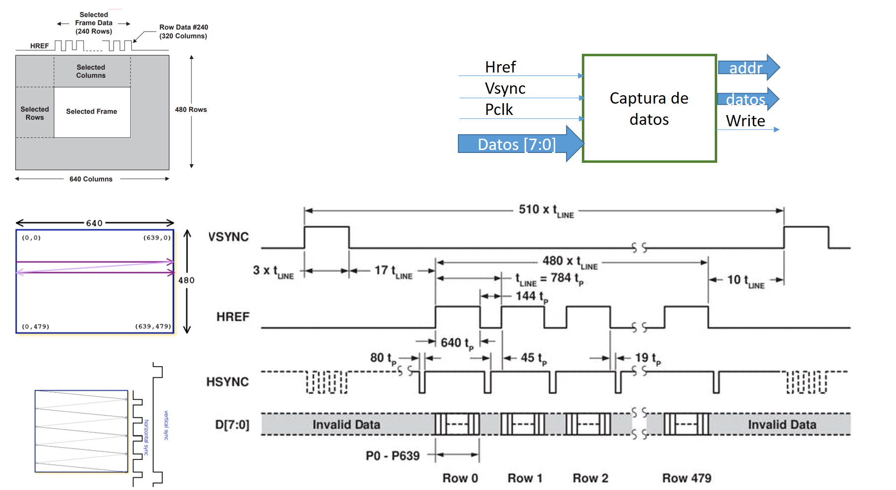
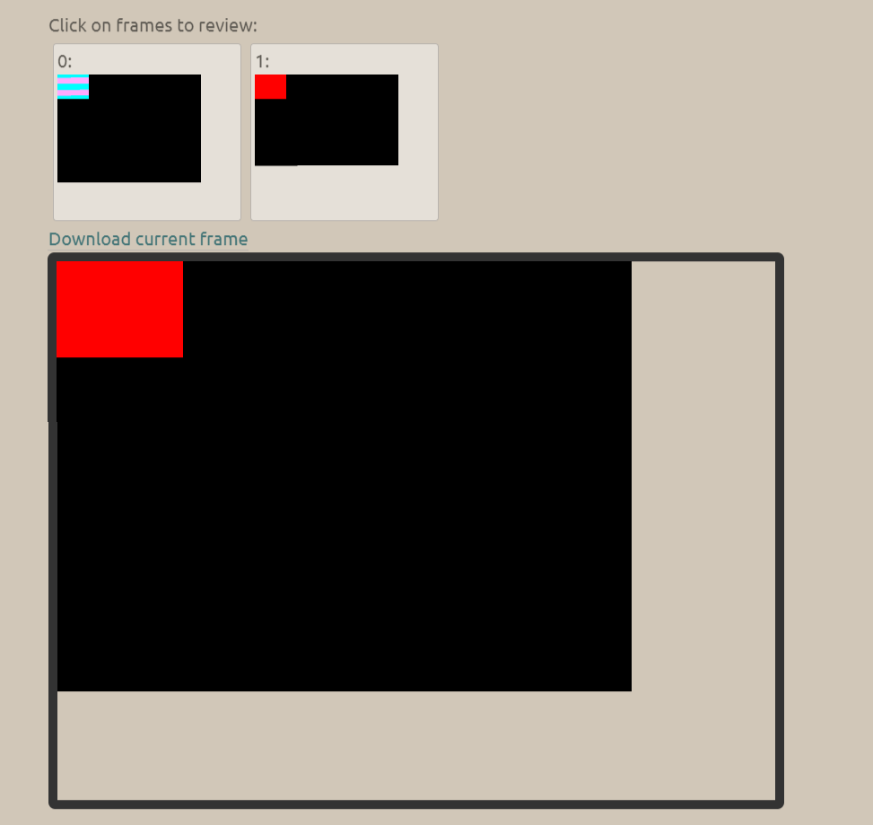

## ELECTRÓNICA DIGITAL 1 2020 -2 UNIVERSIDAD NACIONAL DE COLOMBIA
## TRABAJO 02- diseño y prueba del HDL para la cámara OV7670

Consideraciones
- Recuerde, esta documentación debe ser tal que, cualquier compañero de futuros semestres comprenda sus anotaciones y la relación con los módulos diseñados.

*Figura 1.Esquema general*

### Tareas asignadas
#### 1. Módulo captura_datos_downsampler.v

*Figura 2.Módulo de captura de datos*

Funcionamiento de la cámara

***RECUEDE: Es necesario documentar el módulo diseñado con los respectivos diagramas funcionales y estructurales y registrar la información en README.md***

#### 2. Revisar si el bloque PLL, `clk_32MHZ_to_25M_24M.v`

- Adaptar el bloque azul PLL para las frecuencias de 24 MHz y 25 MHz para la pantalla VGA y la cámara respectivamente según la FPGA a utilizar, que en nuestro caso tiene un reloj de 50 MHz. El archivo es clk_32MHZ_to_25M_24M.v y se encuentran en el interior de la carpeta hdl/scr/PLL.

Para este hito se recomienda generar un nuevo PLL con `Clocking Wizard`. en el IDE de ISE debe utilizar `tools -> Core Generator ...` y general el ip con Clocking Wizard. Una vez, generado el nuevo bloque de Clk:
* Copiar el archivo en la carpeta `hdl/scr/PLL`.
* Remplazar en el proyecto **test_cam.xise**, el archivo `clk_32MHZ_to_25M_24M.v` por el generado pro ustedes.
* Cambiar los datos necesarios en el archivo `test_cam.v` para instanciar el nuevo PLL.
* Documentar en README.md el proceso realizado.

Supongo que seguir los cuatro primeros pasos.

#### 3. Modificación del archivo test_cam.v para señales de entrada y salida de la cámara.

 Modificar el módulo test_cam.v para agregar las señales de entrada y salida necesarias para la cámara (señales amarillas del diagrama).

#### 4. Instanciamiento módulo captura_datos_downsampler.v

Instanciar el módulo diseñado en el hito 1 y 2 en el módulo `test_cam.v`.

- Supongo que es solamente el hito 1.

#### 5. Implementación del proyecto

 Implementar el proyecto completo y documentar los resultados. Recuerde adicionar el nombre de las señales y módulos en la Figura 1 y registre el cambio en el archivo README.md

### Simulación

Como se ha explicado en la reuniòn es un entorno de simulación completo de la càmara y la pantalla VGA.

A la plantilla de proyecto se adicionan los siguientes archivos:
1. ***cam_read.v*** fichero que contiene la declaraciòn de la caja negra, con las respectivas entradas  y salidas. Este archivo debe se utilizado para realiza la descripción funcional de la captura de datos de la camara en formato RGB565
2. ***test_cam_TB.v*** fichero que contiene la simulación de las señales  de la camara y almacena la salida VGA en un archivo de texto plano.  

***RECUEDE: Es necesario documentar el módulo diseñado con los respectivos diagramas funcionales y estructurales y registrar la información en README.md ***

Una vez clone el repositorio, en su computador de la plantilla del proyecto

1. Cargar el proyecto en el entorno y analizar el archivo ***test_cam_TB.v***.
2. En las propiedades de simulaciòn modificar el tiempo de simulación a 30ms. y generar la simulación.
3. Una vez terminada la simulaciòn revisar dentro del directorio `HW` que contenga el fichero ***test_vga.txt***
4. ingresar a la web [vga-simulator](https://ericeastwood.com/lab/vga-simulator/)  y cargar el archivo ***test_vga.txt***, dejar los datos de configuraciòn tal cual como aparecen.
5. ejecutar `submit`.
6. Compruebe que el resultado en la web es la siguiente imagen

***Nota:*** Observe que en esta instancia usted no ha modificado el hardware del proyecto, por lo tanto, lo que observa en la pantalla VGA simulada, es la imagen almacenada en memoria por defecto.

7. Una vez tenga listo el anterior entorno de trabajo, debe proceder a  modificar el fichero  ***cam_read.v***. Solamnte en este módulo debe trabajar  y describir el funcionamiento de la adquiciòn de los datos de la cámara.

8. Al terminar de decribir la adquisión de la cámara repita los paso 2 a 6.  Si el resultado es el que se observa en la siguiente imagen, indica que el módulo cam_read es adecuado y por lo tanto, se dara por terminado este paquete de trabajo, de lo contrario  vuelva al punto 7.

la imagen muestra que se adquirió una foto de color rojo.

***RECUEDE: Es necesario documentar la simulación y registrar la información en README.md, lo puede hacer con ayuda de imágenes o videos***

### Implementación

Al culminar los hitos anteriores deben:

1. Crear el archivo UCF.
2. Realizar el test de la pantalla. Programar la FPGA con el bitstream del proyecto y no conectar la cámara. ¿Qué espera visualizar?, ¿Es correcto este resultado ?
3. Configure la cámara en test por medio del bus I2C con ayuda de Arduino. ¿Es correcto el resultado? ¿Cada cuánto se refresca el buffer de memoria ?
4. ¿Qué falta implementar para tener el control de la toma de fotos ?

***RECUEDE: Es necesario documentar la implementación y registrar la información en README.md, lo puede hacer con ayuda de imágenes o videos***
